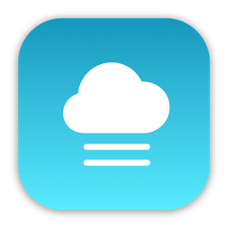
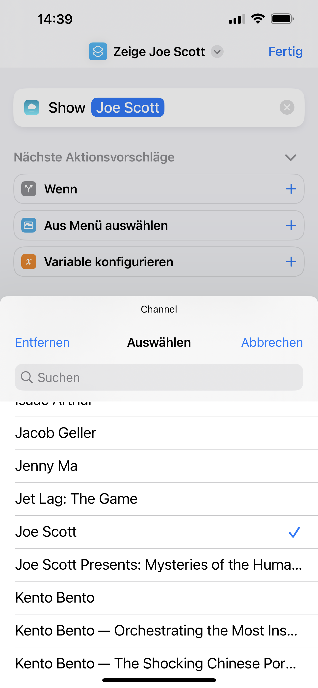
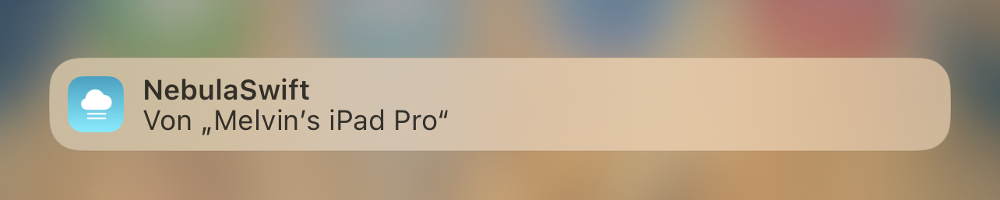
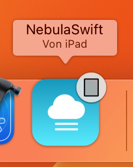

# NebulaSwift

Nebula Streaming Client created in Swift & SwiftUI

Originally started due to the lack of picture-in-picture support in the official app, it now supports pretty much all features of the official app, and more. In addition to the iPhone and iPad, it also natively supports the Mac.

## Impressions

### My Shows

Jump straight to your favorite shows in the sidebar.

### Video Preview

Press and hold a video tile to take a quick peek.

### Video Progression

Quickly glance how far you've watched a video.

### Picture-in-Picture

Continue watching in the background.

### Shortcuts integration

Interact with NebulaSwift via a growing collection of shortcuts.

### Siri

Thanks to a deep integration with the system, you can say things like "Remind me of this" or "Send this to my friend" when looking at content.

### Handoff

Watching a video on the iPad, but needing to leave the house? Just continue on your iPhone right where you left off.

### Quick Notes

Add rich content to your notes and link back to a video or channel.

### Multiplatform

Works on iPhone, iPad and Mac.

## Build

Since I've used the project to try out new things from WWDC22, the *main* branch requires Xcode 14 and macOS 13 or iOS 16. The *release* branch still supports macOS 12 and iOS 15, but doesn't contain all features.
